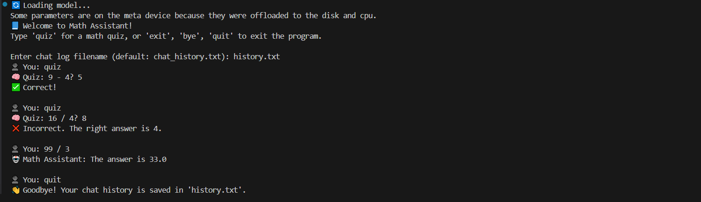
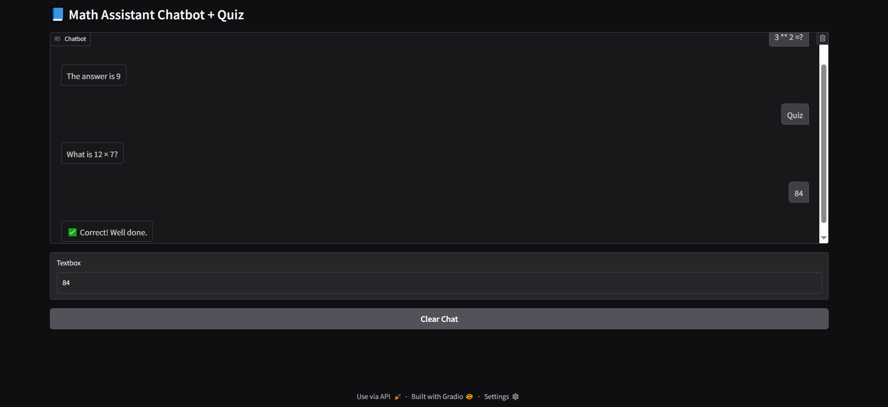

# Math Assistant Chatbot

A simple math tutor chatbot using [TinyLLaMA 1.1B Chat](https://huggingface.co/TinyLLaMA/TinyLLaMA-1.1B-Chat-v1.0), built with Hugging Face Transformers and Gradio.

## Features
- Chat with an AI-powered math assistant
- Quiz mode for basic math practice
- Saves chat history with timestamp to `chat_history.txt`
- Interactive GUI web app powered by Gradio for easy use in browser
- Lightweight, runs locally using TinyLLaMA model

## Screenshot
- Terminal


 - Gui


## Notes
- Only evaluates simple math expressions like `3 * 7`, `10 + 5`, or `2 ^ 3` instantly before using the language model.
- Features a web-based GUI using [Gradio](https://gradio.app/), allowing interactive chatting in your browser at `http://127.0.0.1:7860`.
- Chat history is saved with timestamps in `chat_history.txt` file.
- The GUI supports English input/output for better interaction.
- Some functions are still experimental and may cause unexpected behavior.
- Future improvements include better quiz handling and enhanced UI.

## How to Run
1. Install dependencies:
    ```bash
    pip install -r requirements.txt
    ```

2. Run the app:
    ```bash
    python app.py
    ```

3. Open your browser at:
    ```
    http://127.0.0.1:7860
    ```

4. Start chatting with the Math Assistant in English!

5. Use the **Clear Chat** button to reset conversation.
